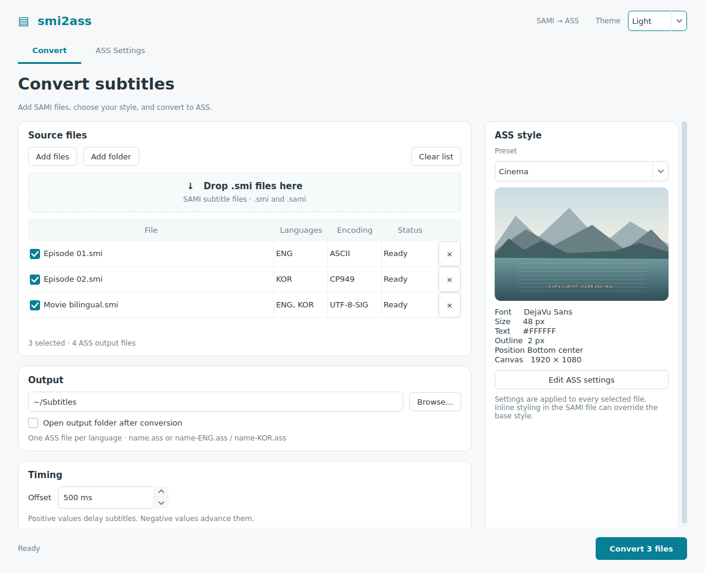
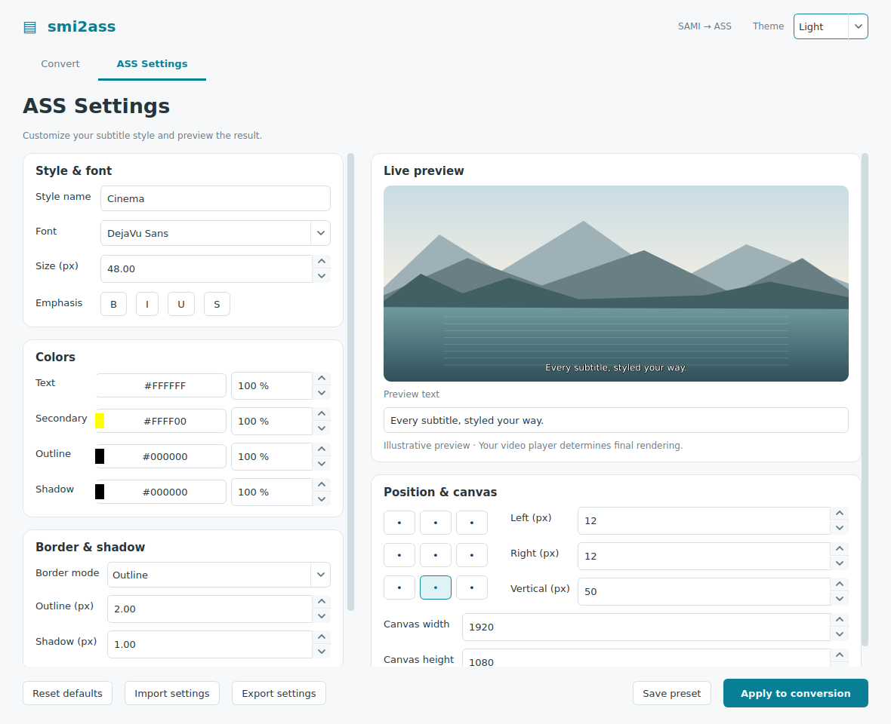
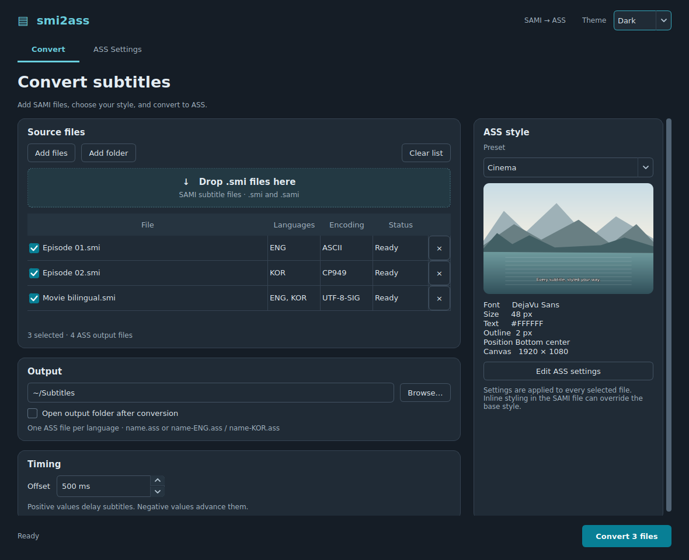
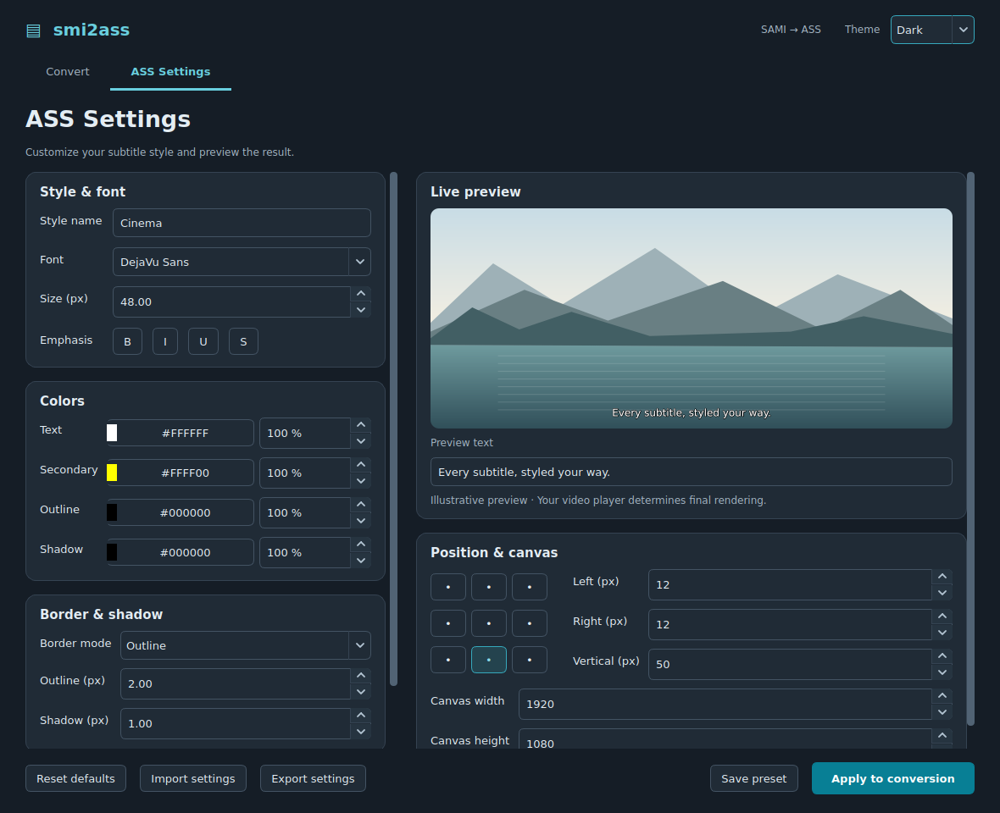

# smi2ass

`smi2ass` converts SAMI (`.smi`) subtitles to SSA/ASS (SubStation Alpha) with a desktop GUI and command-line interface, including separate output files for multiple languages.

## Screenshots

**Convert:** queue files, choose a preset, and adjust subtitle timing.



**ASS Settings:** edit fonts, colors, opacity, alignment, and margins with a live preview.



<details>
<summary>View the dark theme</summary>





</details>

Screenshots show the running desktop interface with sample subtitle files. The preview is illustrative; final subtitle rendering depends on your video player.

## Download or install

**V2 (package version 2.0) is being prepared for release**, with separate GUI and CLI downloads. See [V2 release notes](RELEASE_NOTES.md) for its features, planned assets, and verification commands. Until V2 is published, the current stable download below provides the CLI.

[Download V1.5.1](https://github.com/LinearAlpha/smi2ass/releases/tag/V1.5.1) for **Windows x86-64** or **Linux x86-64**. Extract the entire ZIP or 7z archive and keep the editable `setting` directory beside the executable. Standalone executables do not require Python. V1.5.1 Linux binaries are built and tested on Ubuntu 26.04.

The release includes `SHA256SUMS.txt` for verifying downloads. Each executable archive includes `BUILD-INFO.json` identifying the source commit and build dependencies.

For a Python installation, use **Python 3.11 or later** and install the wheel attached to the release:

```shell
python -m pip install smi2ass-1.5.1-py3-none-any.whl
```

Or install from a checkout:

```shell
python -m pip install .
```

Both installations provide the `smi2ass` command and `python -m smi2ass`. Runtime dependencies (`beautifulsoup4`, `charset-normalizer`, and `webcolors`) are installed automatically. The packages are distributed through GitHub Releases; these commands do not assume a PyPI release.

### V1.5.1 assets and SHA-256 verification

The [V1.5.1 release](https://github.com/LinearAlpha/smi2ass/releases/tag/V1.5.1) has seven assets:

- `SHA256SUMS.txt` (checksums for the six distributions below)
- `smi2ass-1.5.1-py3-none-any.whl`
- `smi2ass-1.5.1.tar.gz`
- `smi2ass_linux_x86-64.7z`
- `smi2ass_linux_x86-64.zip`
- `smi2ass_windows_x86-64.7z`
- `smi2ass_windows_x86-64.zip`

Download `SHA256SUMS.txt` and your chosen distribution from that release into the same directory. Run the following there before extracting or installing, replacing the example filename with your downloaded asset's exact name.

**Windows PowerShell:**

```powershell
$file = 'smi2ass_windows_x86-64.zip'
$line = Get-Content .\SHA256SUMS.txt | Where-Object { $_.EndsWith("  $file") }
if (!$line) { throw "No checksum for $file" }
$expected = ($line -split '\s+')[0]
if ((Get-FileHash -Algorithm SHA256 -LiteralPath $file).Hash -ne $expected) {
    throw "SHA-256 verification failed: $file"
}
"Verified: $file"
```

**Linux:**

```sh
file='smi2ass_linux_x86-64.zip'
awk -v file="$file" '$2 == file { print }' SHA256SUMS.txt | sha256sum -c -
```

**macOS:**

```sh
file='smi2ass-1.5.1-py3-none-any.whl'
awk -v file="$file" '$2 == file { print }' SHA256SUMS.txt | shasum -a 256 -c -
```

Proceed only when PowerShell prints `Verified: <filename>` or Linux/macOS prints `<filename>: OK`. A mismatch, missing file, or missing checksum is a verification failure.

## Usage

```shell
smi2ass --version
smi2ass my_subtitles.smi
smi2ass -o converted "first episode.smi" "second episode.smi"
smi2ass --add_time 500 -f "Arial" -s 36 my_subtitles.smi
smi2ass --sub_time 500 my_subtitles.smi
smi2ass --help
```

For an extracted executable, use `./smi2ass` on Linux or `.\smi2ass.exe` in Windows PowerShell. On Linux, if necessary, run `chmod +x smi2ass` after extraction.

By default, files are written to `out` under the current working directory. A single-language subtitle produces `out/my_subtitles.ass`. A multilingual subtitle produces files such as:

```text
out/my_subtitles-ENG.ass
out/my_subtitles-KOR.ass
```

Use `-o` to select another output directory. Time offsets are in milliseconds; use either `--add_time` or `--sub_time`.

### Settings

Default font styles and language codes are bundled with the Python package, so conversion works from any directory. Executables use the editable `setting/ass_styles.json` and `setting/lan_code.json` files beside the executable when that folder exists.

`lan_code.json` recognizes 184 languages using the [Library of Congress ISO language code list](https://www.loc.gov/standards/iso639-2/ISO-639-2_utf-8.txt): ISO 639-1 languages plus Filipino. Class aliases include two-/three-letter codes with or without `CC`, and selected regional forms used by SAMI captions (for example, `FRFRCC` and `PTBRCC`). Lookup is case-insensitive; unknown classes still use `und`. Output suffixes use ISO 639-2 bibliographic codes, including the existing `CHI` for Chinese.

| Language | Example SAMI classes | Multilingual output suffix |
| --- | --- | --- |
| French | `FRCC`, `FRFRCC`, `FRACC` | `FRE` |
| German | `DECC`, `DEDECC`, `DEUCC` | `GER` |
| Spanish | `ESCC`, `ESMXCC` | `SPA` |
| Portuguese | `PTCC`, `PTBRCC` | `POR` |
| Arabic | `ARCC`, `ARACC` | `ARA` |
| Hindi | `HICC`, `HIINCC` | `HIN` |
| Vietnamese | `VICC`, `VIVNCC` | `VIE` |
| Filipino | `FILCC`, `FILPHCC` | `FIL` |

Existing Korean aliases `KR`/`KRCC` remain Korean; use `KAU`/`KAUCC` for Kanuri. For a custom class name, add an explicit entry to your `lan_code.json`, such as `"MYFRENCH": "fre"`.

For custom settings with any installation, copy the defaults from [`src/setting`](src/setting) into your own directory, edit them, and run:

```shell
smi2ass --settings-dir my-settings my_subtitles.smi
```

**Upgrading:** source defaults now live in `src/setting`; source/package installations no longer implicitly read `./setting`. Use `--settings-dir` for an existing custom directory. Python 3.11 is the supported minimum, correcting the older metadata's unsupported `>3.7` claim.

### Supported tags and input encodings

The converter handles paragraph, line-break, bold, italic, underline, strike-through, and font-color tags. Input encoding is detected by charset-normalizer; regression tests cover Korean CP949/EUC-KR and UTF-8, UTF-8 BOM, and UTF-16 inputs. Output is UTF-8 ASS. Automatic encoding detection is heuristic; check the output when working with unusual or very short inputs.

### Fixing a bad SAMI file

The converter prints the file being processed and diagnostic fragments for malformed language or time tags. For example, a misspelled `Start` attribute can produce `Failed to extract time code`. Correct the `.smi` file and run the conversion again.

## Desktop GUI

The desktop interface in this checkout has **Convert** and **ASS Settings** tabs. Install the optional GUI dependency in your virtual environment and launch it:

```shell
python -m pip install -e ".[gui]"
smi2ass-gui
```

You can also use `python -m smi2ass.gui` or `smi2ass-gui "Episode 01.smi"`. The existing CLI installation and commands remain available.

On Ubuntu, install Qt's graphics and X11 runtime libraries before running or building the GUI (a desktop session is required to use the window):

```shell
sudo apt-get update
sudo apt-get install -y libegl1 libgl1 libx11-xcb1 libxcb-cursor0 libxcb-icccm4 libxcb-keysyms1 libxkbcommon-x11-0
```

- **Convert:** add files, drag and drop `.smi`/`.sami` files, or add a folder (including subfolders). Select files, choose an output folder and preset, and optionally set a signed timing offset in milliseconds. Conversion runs in the background; Cancel stops after the current file. Hover over an Error status for details.
- **ASS Settings:** edit font, emphasis, four colors and their opacity, outline/shadow, alignment, margins, and canvas size. Advanced style options include scaling, spacing, rotation, encoding, title, timer, and script options. The illustrative preview updates immediately; final rendering depends on your video player and installed fonts. Inline SAMI styling can override the base style.
- **Presets:** Apply to conversion saves the current settings for future sessions. Save preset also creates a named preset. Import/Export settings uses the same JSON format as `ass_styles.json`, so an exported file can be used with the CLI's `--settings-dir` alongside `lan_code.json`. GUI preferences are stored in the current user's application configuration directory.
- **Theme:** choose Light or Dark in the window header. The choice is saved for future launches and does not change subtitle colors.

Existing output files require confirmation before replacement. Sources that would produce the same output filename are marked as errors; convert them to different folders. Timing offsets can discard cues shifted before the start of the video, following the existing converter behavior.

V2 provides separate CLI and GUI archives; the published V1.5.1 assets contain only the CLI. GUI binaries use `smi2ass-gui` (`smi2ass-gui.exe` on Windows). The Windows GUI opens without a console window. Python GUI installations also work on macOS; executable archives target Windows/Linux x86-64.

After downloading the V2 wheel, install its optional GUI extra with:

```shell
python -m pip install "./smi2ass-2.0-py3-none-any.whl[gui]"
smi2ass-gui
```

To run the GUI checks with the extra installed:

```shell
python -m unittest discover -s src/test -v
python scripts/smoke_gui.py
```

## Development and testing

Create and activate a virtual environment, then install the project:

```shell
python -m venv .venv
# Linux/macOS: source .venv/bin/activate
# Windows PowerShell: .venv\Scripts\Activate.ps1
python -m pip install -e .
python -m unittest discover -s src/test -v
python scripts/smoke_test.py
```

CI runs the regression tests and installed CLI smoke tests on **Python 3.11–3.14, Windows and Ubuntu 26.04**, plus desktop GUI tests on Python 3.14. It also tests fresh wheel/source CLI and GUI installations, independently compiles CLI and GUI Linux/Windows executables with Python 3.14 (Linux builds use Ubuntu 26.04), and tests both extracted archive formats outside the checkout.

## Build distributions

For a complete local build, install **Python 3.14 x86-64** and a native C compiler (GCC on Linux or a supported Windows compiler), then run the script for your OS from the checkout:

```shell
# Linux x86-64
./build.sh              # Build both CLI and GUI
./build.sh --target cli # Build only the CLI
./build.sh --target gui # Build only the GUI
```

```powershell
# Windows x86-64
.\build.ps1             # Build both CLI and GUI
.\build.ps1 -Target cli # Build only the CLI
.\build.ps1 -Target gui # Build only the GUI
```

The scripts create or reuse `.build-venv`, install build/runtime dependencies, build and check the wheel/source distributions, and compile, archive, and smoke-test the selected executables for your OS. Qt is installed only when the GUI is selected. No virtual-environment activation is needed. Each script stops on a failed step. Old `smi2ass` wheel/source files in `dist` are replaced so repeated builds verify only the current pair.

CLI and GUI compilation automatically use one parallel compiler job per available logical CPU, respecting the process's CPU affinity. The selected job count is printed at the start of each compilation. No extra build flag is needed.

To clean generated files before building, add `-Clean` (Windows) or `--clean` (Linux). To clean without building, use `-CleanOnly` or `--clean-only`:

```powershell
.\build.ps1 -Clean -Target all # Clean, then build CLI and GUI
.\build.ps1 -CleanOnly        # Clean and exit
```

```shell
./build.sh --clean --target all # Clean, then build CLI and GUI
./build.sh --clean-only         # Clean and exit
```

Cleanup removes both targets' `build`, `dist`, and `release-assets` folders, generated project metadata, Python caches under `src`/`scripts`, and the Nuitka crash report. Source code, settings, subtitle files, and virtual environments are preserved. It does not follow links into external directories. Cleanup-only requires the same Python 3.14 interpreter as the build scripts, but installs no dependencies. The shared cleanup can also be run directly with `python scripts/clean_project.py`.

To run the same steps manually with a Python 3.14 virtual environment active:

```shell
python -m pip install ".[gui]" -r requirements-build.txt
python -m build
python -m twine check --strict dist/*
python scripts/check_distributions.py --gui
python scripts/build_executable.py --target all
python scripts/package_assets.py --target all
```

Wheel/source distributions are written to `dist`; executables are written to `build/cli` and `build/gui`, with separate ZIP/7z archives in `release-assets`:

| Target | Linux archives | Windows archives |
| --- | --- | --- |
| CLI | `smi2ass_linux_x86-64.zip` / `.7z` | `smi2ass_windows_x86-64.zip` / `.7z` |
| GUI | `smi2ass-gui_linux_x86-64.zip` / `.7z` | `smi2ass-gui_windows_x86-64.zip` / `.7z` |

Each archive contains its corresponding executable, editable settings, documentation, and `BUILD-INFO.json`. Nuitka requires a native C compiler (GCC on Linux or a supported Windows compiler); Linux additionally uses `patchelf`. `scripts/build_executable.py` uses the active Python environment and is the authoritative standalone/one-file build configuration.

To prepare a release, update the project/CLI versions together, the `tool.smi2ass.release.tag` in `pyproject.toml`, and both release documents. A commit titled `prepare release: V2` on `main` builds and verifies the artifacts, then creates a **draft** with the wheel/source distributions, eight CLI/GUI archives, and SHA-256 checksums (11 assets total). Publish that prepared draft from GitHub Releases when ready.

For a new release that should publish automatically after verification, use a commit titled `release: V<version>` or run CI manually on `main` with `publish` enabled. All test, package, GUI, and executable jobs must succeed first. Ordinary commits and PRs only validate artifacts. An existing release is never overwritten.

See [release notes](RELEASE_NOTES.md) and [the changelog](CHANGELOG.md).

## Contributors and origins

This project builds on [@hojel's service.subtitles.gomtv](https://github.com/hojel/service.subtitles.gomtv/tree/3a7342961e140eaf8250659b0ac6158ce5e6bc5c/resources/lib) and [@trustin's smi2ass](https://github.com/trustin/smi2ass/tree/v0.1.1), which provided the original conversion script.

| Contributor | Contributions |
| --- | --- |
| [@LinearAlpha](https://github.com/LinearAlpha) (Minpyo Kim) | Maintains this project; rewrote the converter using classes; corrected RGB-to-BGR handling; added JSON-based ASS settings, CLI font/title/resolution controls, time offsets, builds, and color regression tests/CI ([#2](https://github.com/LinearAlpha/smi2ass/pull/2)). |
| [@najoan125](https://github.com/najoan125) (Najoan) | Fixed named font colors by removing the leading `#` before RGB-to-BGR conversion ([#1](https://github.com/LinearAlpha/smi2ass/pull/1)); replaced chardet with charset-normalizer and reported the related executable-build problem ([#3](https://github.com/LinearAlpha/smi2ass/pull/3)). |
| [@hojel](https://github.com/hojel) and [@trustin](https://github.com/trustin) | Original upstream subtitle conversion work from which this project was forked. |

Thanks to everyone who contributes code, tests, bug reports, and improvements. See the [commit history](https://github.com/LinearAlpha/smi2ass/commits/main/) for individual changes. Licensing terms are in [LICENSE.txt](LICENSE.txt).

